# Homelab — Self-Hosted Hybrid Cloud Infrastructure

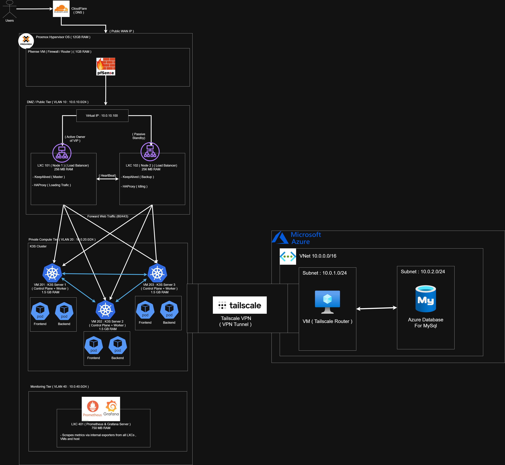

## 🏗️ Infrastructure Overview

This project runs on a self-hosted **Proxmox VE** hypervisor (configured as a nested-virtualization VM, 12 GB RAM allocated) that hosts the entire on-prem stack. Traffic is segmented across three isolated VLANs, and the on-prem cluster is bridged to **Microsoft Azure** over a **Tailscale** VPN mesh for data persistence — a hybrid cloud setup that keeps compute on-prem while offloading the database to a managed cloud service.

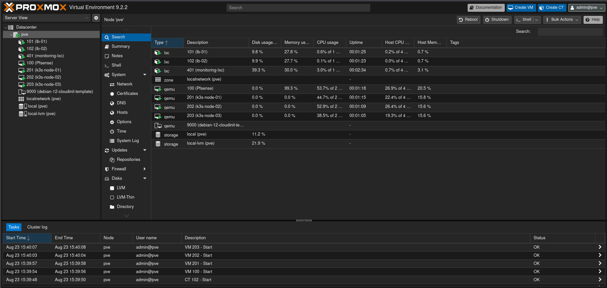
*Proxmox VE — all LXCs (load balancers, monitoring) and VMs (pfSense, K3S nodes) running on the `pve` node.*

### High-Level Traffic Flow

```
Users → Cloudflare (DNS) → Public WAN IP → pfSense (Firewall/Router)
      → VLAN 10 (DMZ) → HAProxy/Keepalived → VLAN 20 (K3S Cluster)
                                            → VLAN 40 (Monitoring)
      → Tailscale VPN tunnel → Azure (Tailscale Router VM) → Azure Database for MySQL
```

### 1. Edge & DNS

- **Cloudflare** handles public DNS resolution and points to the network's public WAN IP.
- Inbound traffic hits **pfSense**, a virtualized firewall/router (1 GB RAM) responsible for perimeter security and routing between VLANs.

### 2. Network Segmentation

pfSense splits the internal network into three isolated VLANs:

| VLAN | Purpose | Subnet |
|------|---------|--------|
| VLAN 10 | DMZ / Public Tier (load balancers) | `10.0.10.0/24` |
| VLAN 20 | Private Compute Tier (K3S cluster) | `10.0.20.0/24` |
| VLAN 40 | Monitoring Tier (Prometheus/Grafana) | `10.0.40.0/24` |

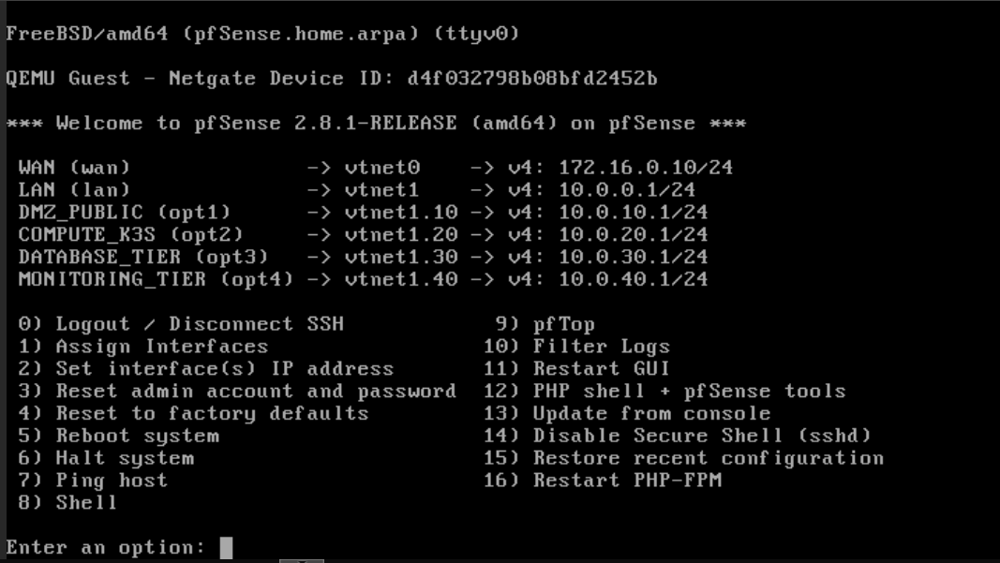
*pfSense console showing every tagged VLAN interface with its gateway IP — including the `DATABASE_TIER` (`10.0.30.0/24`) interface reserved for future use alongside the DMZ, compute, and monitoring tiers.*

### 3. DMZ / Public Tier — High Availability Load Balancing (VLAN 10)

This tier exposes a **Virtual IP (`10.0.10.100`)** shared between two LXC containers running **Keepalived + HAProxy**, providing automatic failover:

- **LXC 101 (Node 1)** — 256 MB RAM — Keepalived *Master* (active owner of the VIP), HAProxy actively load-balancing traffic.
- **LXC 102 (Node 2)** — 256 MB RAM — Keepalived *Backup* (passive standby), HAProxy idling.
- The two nodes exchange **VRRP heartbeats**; if Node 1 fails, Node 2 takes ownership of the VIP and starts forwarding traffic — no manual intervention required.
- The active load balancer forwards web traffic (ports **80/443**) into the private compute tier.

### 4. Private Compute Tier — K3S Cluster (VLAN 20)

A lightweight **K3S** Kubernetes cluster runs across three VMs, each acting as both **control plane and worker** for full HA at the cluster level:

- **VM 201 — K3S Server 1** — 1.5 GB RAM
- **VM 202 — K3S Server 2** — 1.5 GB RAM
- **VM 203 — K3S Server 3** — 1.5 GB RAM

The three nodes form an embedded-etcd HA control plane and communicate with each other over the cluster network. Each node runs **Frontend** and **Backend** pods, and the HAProxy layer distributes incoming traffic across all three nodes.

### 5. Monitoring Tier (VLAN 40)

- **LXC 401 — Prometheus & Grafana Server** — 750 MB RAM
- Scrapes metrics via internal exporters from every LXC, VM, and the Proxmox host itself, giving full-stack observability (host, network tier, and cluster) from a single dashboard.

### 6. Hybrid Cloud Integration — Microsoft Azure

To keep persistent data resilient and offloaded from the on-prem hardware, the cluster is bridged to Azure:

- **VNet** `10.0.0.0/16`
  - **Subnet `10.0.1.0/24`** — hosts a VM running as the **Tailscale router**, acting as the Azure-side exit node for the VPN mesh.
  - **Subnet `10.0.2.0/24`** — hosts **Azure Database for MySQL**, the managed database backing the application.
- **Tailscale** establishes a secure, encrypted **VPN tunnel** between the on-prem K3S cluster and the Azure VNet, so pods reach the Azure MySQL instance as if it were on the local network — no public database exposure, no site-to-site VPN appliance required.

### 7. Firewall Rules — Zero Trust Between Tiers

pfSense enforces per-VLAN rules so each tier can only reach exactly what it needs — nothing is trusted by default just because it's "internal":

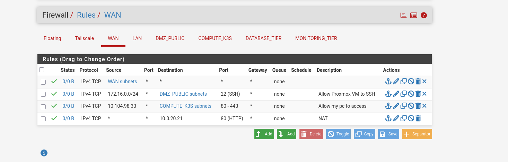
*WAN — only inbound SSH to the DMZ (from the Proxmox management subnet) and HTTP/HTTPS to the K3S tier are allowed in; everything else is dropped at the edge.*

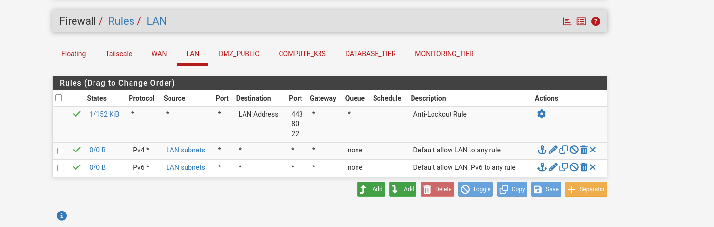
*LAN — the trusted management network, with default allow-any-out and a built-in anti-lockout rule protecting access to the pfSense GUI itself.*

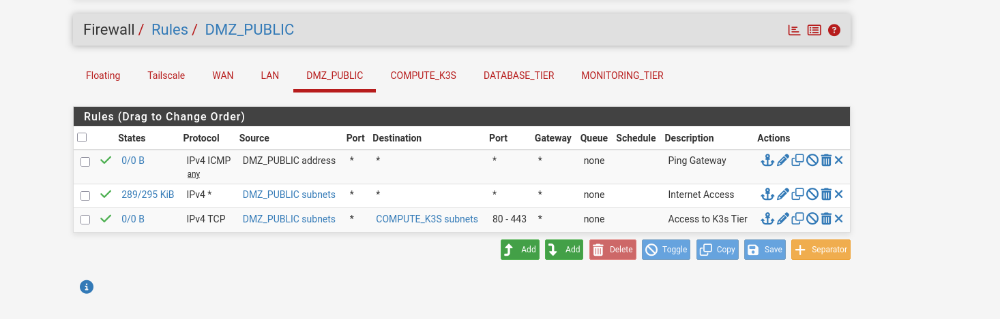
*DMZ_PUBLIC (VLAN 10) — the load balancers can ping the gateway, reach the internet, and forward to the K3S tier on 80/443, but nothing more.*

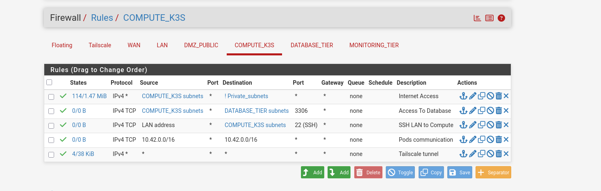
*COMPUTE_K3S (VLAN 20) — the cluster gets internet access (for pulling images), can reach the database tier on port 3306, accepts SSH only from the LAN, allows pod-to-pod traffic on the Flannel overlay (`10.42.0.0/16`), and has a dedicated rule for the Tailscale tunnel.*

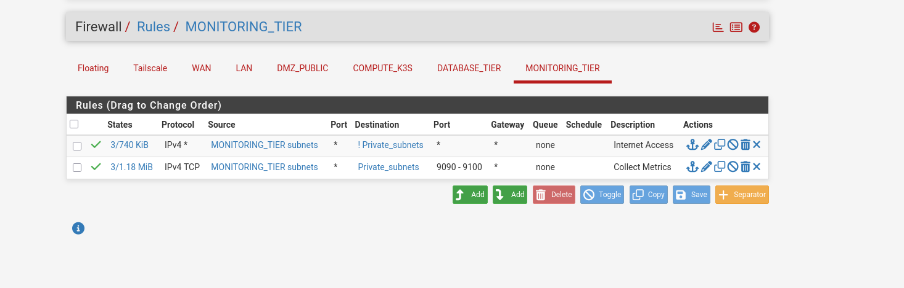
*MONITORING_TIER (VLAN 40) — Prometheus/Grafana can reach the internet and pull metrics from every private subnet on the exporter port range (9090–9100), but other tiers can't reach in.*

Each ruleset follows least-privilege: a tier's rules describe *what it's allowed to initiate*, not what's allowed to reach it — inbound access into a tier only exists where a rule on the *source* tier explicitly permits it.

---

## ⚙️ Infrastructure as Code

Every piece of the architecture above is provisioned and configured through code — nothing was clicked together manually. **Terraform** builds the resources (Proxmox LXCs/VMs and the Azure stack), and **Ansible** configures the software running on top of them. Both live under [`Infrastructure/`](./Infrastructure) and are split by environment (`dev`/`prod`).

```
Infrastructure/
├── Terraform/
│   ├── envs/dev/            # Environment entrypoint (main.tf, variables.tf, providers.tf)
│   └── modules/
│       ├── lxc/              # Generic Proxmox LXC module
│       ├── vm/                # Generic Proxmox VM module (clone-based)
│       ├── azure_network/     # Azure VNet + subnets + private DNS zone
│       ├── mysql_azure/       # Azure Database for MySQL Flexible Server
│       └── tailscale_router_azure/  # Azure VM acting as the Tailscale exit node
└── Ansible/
    ├── inventory/            # dev.ini / prod.ini host inventories
    ├── group_vars/           # Per-group variables (k3s, load balancers…)
    ├── site.yml               # Main playbook
    └── roles/
        ├── keepalived/        # VIP failover
        ├── haproxy/           # Load balancing
        ├── k3s/                # K3S HA cluster bootstrap
        ├── monitoring/         # Grafana + VictoriaMetrics + Alertmanager
        └── node_exporter/      # Metrics exporter on every host
```

### Terraform — Provisioning

Terraform is built as small, reusable **modules** consumed from a single environment entrypoint (`Terraform/envs/dev/main.tf`), which keeps the actual resource declarations generic and lets the environment file just wire up counts, IPs, and IDs:

- **`modules/lxc`** — wraps the `proxmox_virtual_environment_container` resource (Proxmox provider) to spin up an LXC from a template with static IP, gateway, SSH key injection, VLAN-tagged network interface, and configurable CPU/RAM/disk. Used with a `for_each` over a `load_balancers` map to deploy **LXC 101 / LXC 102** identically on VLAN 10, and again for **LXC 401** (monitoring) on VLAN 40.
- **`modules/vm`** — wraps `proxmox_virtual_environment_vm`, cloning from a template rather than installing from ISO, with cloud-init handling the IP/gateway/SSH-key injection. Used with `count = 3` to deploy **VM 201–203** (the K3S nodes) on VLAN 20, each getting a deterministic VM ID (`201 + count.index`) and IP.
- **`modules/azure_network`** — creates the Azure `azurerm_virtual_network` (`10.0.0.0/16`) with two subnets: one for the Tailscale router VM, and a second **delegated** to `Microsoft.DBforMySQL/flexibleServers` so the MySQL Flexible Server can live inside the VNet with private connectivity. It also provisions the private DNS zone and VNet link required for private MySQL name resolution.
- **`modules/mysql_azure`** — provisions the `azurerm_mysql_flexible_server` with **`public_network_access = "Disabled"`**, attached to the delegated subnet and private DNS zone, plus the application database (`utf8mb4`/`utf8mb4_unicode_ci`). The admin password can be injected via variable or auto-generated with `random_password` if not supplied.
- **`modules/tailscale_router_azure`** — provisions the Ubuntu 22.04 VM that acts as the Azure-side Tailscale subnet router: static private IP, IP forwarding enabled on the NIC (required for it to route traffic between the tailnet and the VNet), a public IP for initial SSH access, and an NSG that only allows SSH from a single trusted source IP.

The `dev` environment's resource group, all four Azure modules, and the on-prem LXC/VM modules are all declared together in one `main.tf`, with `depends_on` chaining (network → MySQL → Tailscale router) so Terraform respects the order Azure needs.

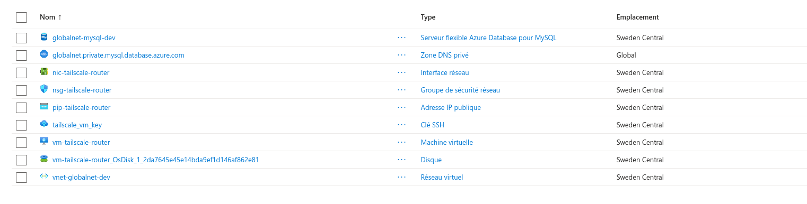
*Every Azure resource above provisioned purely by `terraform apply`: the VNet, both subnets' NIC/NSG/public IP for the Tailscale router VM, its SSH key, and the private-DNS-linked MySQL Flexible Server.*

### Ansible — Configuration

Once Terraform hands off IPs, Ansible takes over via `site.yml`, which runs against inventory groups (`loadbalancers`, `k3s_servers`, `monitoring`, `all`) in sequence:

- **`keepalived` role** — installs Keepalived, enables `net.ipv4.ip_nonlocal_bind` (required so a host can bind the VIP before it actually owns it), and templates `keepalived.conf` per node using inventory-defined variables (`keepalived_role: MASTER/BACKUP`, `keepalived_priority`). A `vrrp_script` polls `haproxy` locally every 2 seconds and demotes the node's priority if HAProxy dies — so the VIP fails over not just on host failure but on **service** failure too.
- **`haproxy` role** — installs HAProxy and templates `haproxy.cfg` with a Jinja loop over `groups['k3s_servers']`, so the backend server list is generated automatically from inventory rather than hardcoded — adding a fourth K3S node only requires an inventory change, not a template edit.
- **`k3s` role** — bootstraps the HA control plane: the first node (`k3s_primary_node`) initializes the cluster with `k3s server --cluster-init` (embedded etcd), and the remaining nodes join via `--server https://<primary_ip>:6443` using a shared `K3S_TOKEN`, giving the 3-node HA control plane shown in the diagram.
- **`monitoring` role** — installs and wires up the observability stack on LXC 401: **Grafana** (official APT repo), **VictoriaMetrics** as the Prometheus-compatible TSDB (systemd service, 1-day local retention), and **Alertmanager**, then templates the scrape config (`prometheus.yml.j2`) with jobs for the Proxmox host, itself, and every K3S node, and provisions the VictoriaMetrics datasource into Grafana automatically — no manual dashboard/datasource clicking.
- **`node_exporter` role** — applied to `hosts: all` at the end of `site.yml`, installing `prometheus-node-exporter` on every node in the inventory so the monitoring role has host-level metrics to scrape from day one.

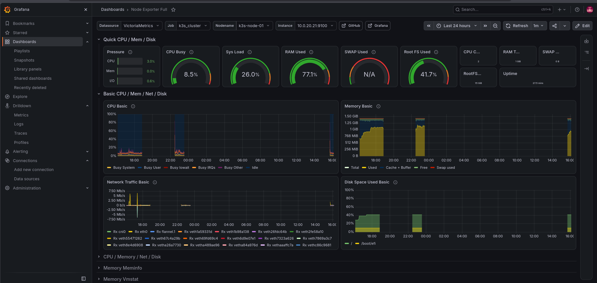
*Grafana's Node Exporter Full dashboard, backed by VictoriaMetrics, showing live CPU/RAM/network/disk metrics scraped from `k3s-node-01`.*

### Why this split

- **Terraform** owns anything that has *state and identity* — VM/LXC existence, IP allocation, Azure resources, network topology.
- **Ansible** owns anything that's *configuration on top of an already-running host* — packages, services, config files, cluster bootstrap.
- Reusable Terraform modules + inventory-driven Ansible templates mean scaling the K3S cluster or adding a third load balancer is a one-line change (`count`, or a new inventory entry), not a copy-pasted resource block.

---

## ☸️ Deployment (Kubernetes)

On top of the K3S cluster provisioned in Section 2, the actual application is deployed declaratively via manifests in [`k8s/`](./k8s) and reconciled by **Argo CD** (GitOps) — nothing is `kubectl apply`'d by hand in normal operation.

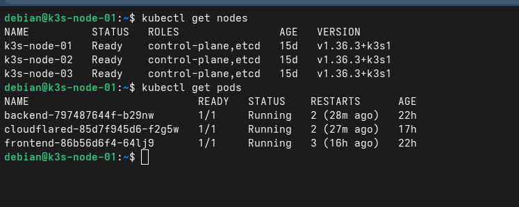
*The 3-node HA control plane (`kubectl get nodes`) and the application pods it's running (`kubectl get pods`) — frontend, backend, and cloudflared, each on its own K3S-managed ReplicaSet.*

```
k8s/
├── argo_app.yaml            # Argo CD Application — watches this repo's k8s/ path
├── frontend.yaml             # Frontend Deployment + Service + nginx ConfigMap
├── backend.yaml               # Backend Deployment + Service
├── config.yaml                 # Shared app ConfigMap (DB connection settings)
├── ingress.yaml                 # Ingress routing / and /api
├── cloudflared.yaml              # Cloudflare Tunnel deployment
└── tailscale-connector.yaml       # In-cluster Tailscale subnet router + DB proxy
```

### GitOps with Argo CD

`argo_app.yaml` defines an Argo CD `Application` pointed at this repo's `k8s/` path with `automated: { prune: true, selfHeal: true }` — meaning the cluster continuously reconciles itself against Git: any manifest committed here is applied automatically, any drift on the cluster is self-healed back to what's in Git, and resources removed from the folder get pruned. This closes the loop with CI: the pipeline builds and pushes the frontend/backend images to **GHCR**, tags them with the commit SHA, rewrites `backend.yaml`/`frontend.yaml` in-place, and pushes that commit back to `main` — Argo CD then picks up the new image tag and rolls it out. No manual deploy step exists between "merge to main" and "running in the cluster."

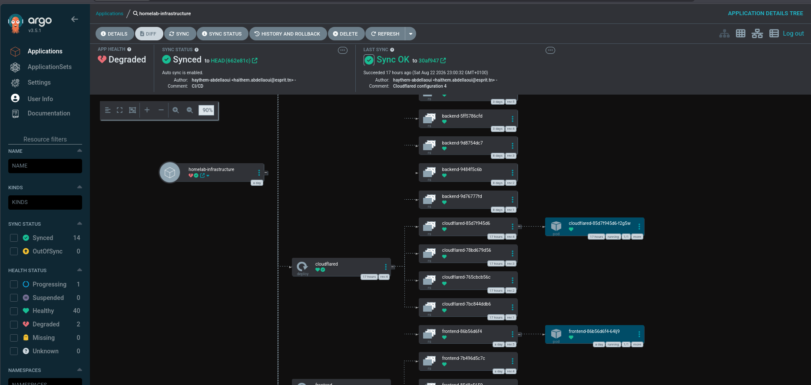
*Argo CD's resource tree for the `homelab-infrastructure` app: every ReplicaSet revision (`rev:1`…`rev:5`) is a past sync, with the currently-running pod highlighted for `frontend` and `cloudflared` — a visual history of every rollout GitOps has performed.*

### Application workloads

- **`frontend.yaml`** — an Nginx-based static frontend Deployment. It mounts a custom `nginx-config` ConfigMap that serves the SPA (`try_files ... /index.html`) and reverse-proxies any `/api` request to `backend-service:3001`, so the frontend container is also acting as the app-level API gateway inside the pod's own Nginx.
- **`backend.yaml`** — the API Deployment, exposed internally via a `ClusterIP` Service (`backend-service:3001`). It pulls its configuration from `envFrom` — both the `app-config` ConfigMap and an `app-secrets` Secret — so no environment values are hardcoded into the image.
- **`config.yaml`** — the shared `app-config` ConfigMap holding non-sensitive settings: Node environment, port, and the MySQL connection parameters (dialect, username, database name, hostname). Notably `DEV_DB_HOSTNAME` points to `azure-mysql.default.svc.cluster.local` — an **in-cluster service name**, not Azure's actual DNS name (see below).
- **`ingress.yaml`** — a standard `networking.k8s.io/v1` Ingress splitting traffic by path: `/api` → `backend-service:3001`, `/` → `frontend-service:80`, so both tiers sit behind a single entrypoint inside the cluster.

### Reaching the outside world: Cloudflare Tunnel

Instead of exposing a NodePort or LoadBalancer, `cloudflared.yaml` runs a **Cloudflare Tunnel** daemon *inside* the cluster that establishes an outbound-only connection to Cloudflare's edge and forwards to `traefik.kube-system.svc.cluster.local:80` (K3S's built-in Traefik ingress controller). This means the K3S cluster and the whole VLAN 20 tier never need an inbound port opened — the DNS/edge layer from Section 1 (Cloudflare) terminates the connection and Cloudflare pushes traffic in through the tunnel rather than pfSense forwarding it in.

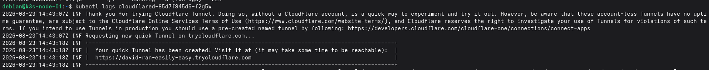
*The `cloudflared` pod's logs on startup, establishing a Cloudflare Quick Tunnel and printing the public URL it's now reachable on — no DNS record or firewall rule needed on the pfSense WAN side.*

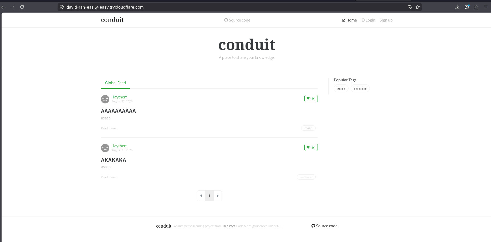
*The deployed application (a RealWorld/Conduit demo app), reached entirely through the Cloudflare Tunnel URL from the log above — confirming the full path from browser → Cloudflare edge → tunnel → Traefik → frontend/backend pods → Azure MySQL actually works end to end.*

### Reaching Azure: in-cluster Tailscale subnet router + DB proxy

`tailscale-connector.yaml` is the most interesting piece — it re-implements the Section 1 Tailscale bridge *inside Kubernetes* rather than relying purely on host-level networking:

1. A `tailscale-connector` Deployment runs two containers in the same pod:
   - **`tailscale`** — joins the tailnet using a `TS_AUTHKEY` pulled from the `app-secrets` Secret, running in **non-userspace mode** (`TS_USERSPACE: "false"`) with `privileged: true` and a mounted `/dev/net/tun`, so it gets a real routable interface rather than a SOCKS/HTTP proxy.
   - **`db-proxy`** (`alpine/socat`) — listens on `3306` inside the pod and forwards raw TCP to `10.0.2.4:3306`, the private IP of the Azure MySQL Flexible Server on the Azure `10.0.2.0/24` subnet. Socat is what actually bridges "a pod inside K3S" to "a private IP that only exists on the tailnet."
2. A `ClusterIP` Service (`tailscale-connector.tailscale.svc.cluster.local:3306`) exposes that proxy port to the rest of the cluster.
3. An `ExternalName` Service, `azure-mysql` in the `default` namespace, aliases to that ClusterIP service — which is exactly the hostname referenced in `config.yaml`'s `DEV_DB_HOSTNAME`.

So the backend pod never talks to Tailscale or Azure directly: it connects to `azure-mysql:3306` like any other in-cluster service, Kubernetes DNS resolves that to the Tailscale connector pod, and `socat` relays the connection over the tailnet to the actual Azure Flexible Server — the hybrid-cloud VPN bridge from Section 1 is made transparent to the application.

A minimal RBAC set (`ServiceAccount` + `Role` + `RoleBinding`, scoped to the `tailscale` namespace) grants the Tailscale container permission to manage its own state `Secret` and emit `Events`, which is what Tailscale's Kubernetes operator/sidecar pattern needs to persist its node identity across pod restarts.

---

## 🔄 CI/CD Pipeline

The pipeline ([`CICD/ci.yml`](./CICD/ci.yml), mirrored as the live workflow at `.github/workflows/ci.yml`) is a single GitHub Actions workflow — **Production Grade CI Pipeline** — that takes a commit all the way from source to a running pod, with Argo CD (Section 3) as the final, separate CD leg. It only triggers on changes under `App/conduit-realworld-example-app/**`, so infra-only commits don't rebuild the app for nothing. A `concurrency` group keyed on branch/ref cancels superseded runs, so pushing twice in a row doesn't waste runners building a commit that's already obsolete.

The workflow is four jobs, each gated on the previous one via `needs`:

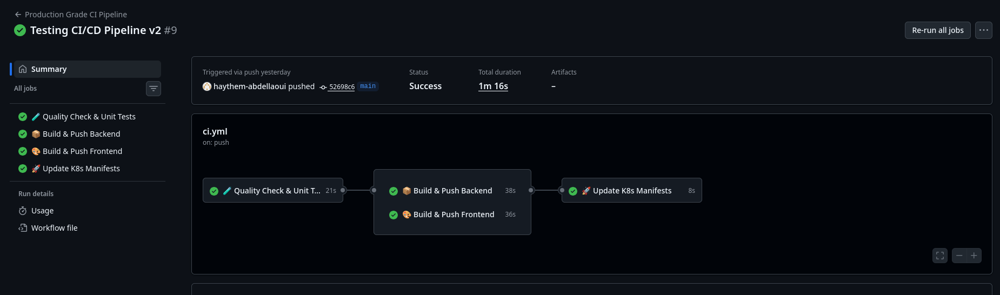
*A successful run: tests pass, backend and frontend build/push to GHCR in parallel, then the K8s manifests are updated — the full commit-to-deploy loop in 1m 16s.*

### 1. 🧪 Quality Check & Unit Tests
Runs on every push and pull request. Checks out the code, sets up Node.js 22 with npm caching keyed on `package-lock.json`, installs dependencies (`npm ci` + `jsdom` as a dev dependency for DOM-based tests), and runs `npm test --if-present`. This job gates everything downstream — the two build jobs both declare `needs: quality-and-tests`, so a failing test suite stops broken code from ever reaching an image build.

### 2. 📦 Build & Push Backend / 3. 🎨 Build & Push Frontend
Two independent jobs (they run in parallel once tests pass) that each:
- Set up Docker Buildx.
- Log in to **GHCR** (`ghcr.io`) — skipped on `pull_request` events, since forked/PR builds shouldn't have push credentials.
- Build the respective `Dockerfile` (`backend/Dockerfile`, `frontend/Dockerfile`) from the `App/conduit-realworld-example-app` context.
- Push two tags: a floating `:latest` and an immutable `:${{ github.sha }}` — the SHA tag is what makes the next job traceable and reproducible, since it ties a specific image directly to a specific commit rather than relying on a mutable tag.

### 4. 🚀 Update K8s Manifests (GitOps)
Only runs on a `push` to `main`/`master` (not on PRs), and only after both images have been built and pushed. This is the job that closes the GitOps loop described in Section 3:
- `sed`-rewrites the `image:` line in `k8s/backend.yaml` and `k8s/frontend.yaml` to point at the freshly-built `:${{ github.sha }}` tag.
- Commits that change as `github-actions[bot]` and pushes it straight back to the repo (`|| echo "No changes to commit"` makes the step idempotent if nothing actually changed).

That commit is the actual hand-off point to CD: Argo CD's `Application` (Section 3) is watching this repo's `k8s/` path with `selfHeal`/`automated` sync enabled, so the moment this bot commit lands, Argo CD detects the drift between Git and the live cluster state and rolls the new image out — no webhook, kubeconfig, or cluster credentials are ever given to GitHub Actions itself.

### Why this design

- **Separation of CI and CD.** GitHub Actions only ever *builds and records intent* (an image + a manifest commit); it never talks to the K3S cluster directly. Argo CD is the only thing with cluster access, which keeps deploy credentials out of the CI runner entirely — a compromised Actions run can't reach the cluster.
- **Immutable, traceable deploys.** Because every deploy is pinned to a `github.sha` image tag written into Git, `k8s/backend.yaml`/`k8s/frontend.yaml` at any point in history tell you exactly which commit is running in production — a `git log` on those two files is effectively a deploy history.
- **Path-filtered triggers** keep the pipeline scoped to app changes, so Terraform/Ansible/K8s-manifest-only commits (Sections 2–3) don't trigger a rebuild — infra and app release cadences stay decoupled.

---

